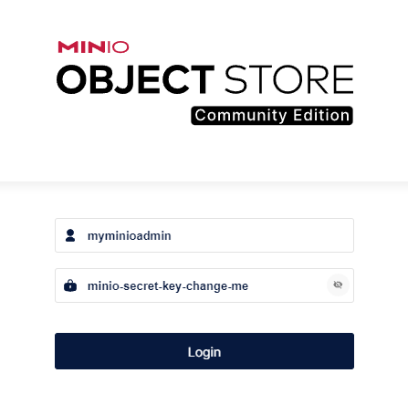
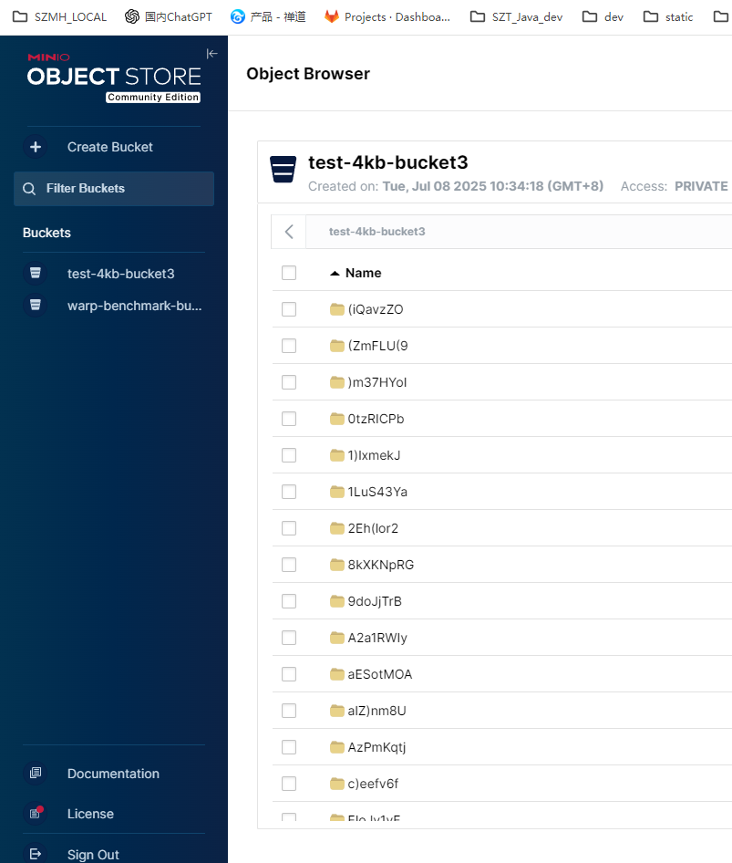

​		MinIO 是一个**高性能、开源的对象存储系统**，主要用于存储非结构化数据（如图片、视频、文档、备份等），与 Amazon S3 完全兼容。它被广泛用于云原生应用、大数据分析、AI 模型存储、容器平台（如 Kubernetes）等场景。

MinIO 的**单节点单磁盘（Single-Node Single-Drive)**  模式适用于开发测试、小规模应用或资源受限的场景。它的部署简单，不依赖集群、分布式架构或复杂的底层存储系统。下面是详细的安装步骤和适用场景说明。

官网地址：https://min.io/docs/minio/linux/operations/install-deploy-manage/deploy-minio-single-node-single-drive.html

---

## 一、MinIO 单节点单磁盘安装步骤

### 1. 环境准备

* 操作系统：建议使用 Linux Ubuntu 24.04
* 硬件：2C  8G  100G

---

### 2. 下载并安装minio

* 安装包方式安装

```bash
wget https://dl.min.io/server/minio/release/linux-amd64/archive/minio_20250613113347.0.0_amd64.deb -O minio.deb
sudo dpkg -i minio.deb
```

使用上面的步骤安装的minio不需要单独在编写Systemd启动服务文件，如果通过二进制方式需要按照第5步所述操作执行。

二进制方式安装

```
wget https://dl.min.io/server/minio/release/linux-arm64/minio
chmod +x minio
mv minio /usr/local/bin/
```

### 3. 创建 MinIO 数据目录

这里我们使用/mnt/data作为Minio的数据目录

```bash
sudo mkdir -p /mnt/data
```

---

### 4. 创建 MinIO 运行用户

```bash
groupadd -r minio-user
useradd -M -r -g minio-user minio-user
chown minio-user:minio-user /mnt/data
```

---

### 5. 编写 Systemd 启动服务文件

```bash
sudo nano /etc/systemd/system/minio.service
```

内容如下：

```ini
[Unit]
Description=MinIO
Documentation=https://docs.min.io
Wants=network-online.target
After=network-online.target
AssertFileIsExecutable=/usr/local/bin/minio

[Service]
Type=notify

WorkingDirectory=/usr/local

User=minio-user
Group=minio-user
ProtectProc=invisible

EnvironmentFile=-/etc/default/minio
ExecStart=/usr/local/bin/minio server $MINIO_OPTS $MINIO_VOLUMES

# Let systemd restart this service always
Restart=always

# Specifies the maximum file descriptor number that can be opened by this process
LimitNOFILE=1048576

# Turn-off memory accounting by systemd, which is buggy.
MemoryAccounting=no

# Specifies the maximum number of threads this process can create
TasksMax=infinity

# Disable timeout logic and wait until process is stopped
TimeoutSec=infinity

# Disable killing of MinIO by the kernel's OOM killer
OOMScoreAdjust=-1000

SendSIGKILL=no

[Install]
WantedBy=multi-user.target

# Built for ${project.name}-${project.version} (${project.name})
```

---

### 6. 编写 环境变量文件

**/etc/default/minio**

```properties
# MINIO_ROOT_USER and MINIO_ROOT_PASSWORD sets the root account for the MinIO server.
# This user has unrestricted permissions to perform S3 and administrative API operations on any resource in the deployment.
# Omit to use the default values 'minioadmin:minioadmin'.
# MinIO recommends setting non-default values as a best practice, regardless of environment
MINIO_ROOT_USER=myminioadmin
MINIO_ROOT_PASSWORD=minio-secret-key-change-me

# MINIO_VOLUMES sets the storage volume or path to use for the MinIO server.

MINIO_VOLUMES="/mnt/data"

# MINIO_OPTS sets any additional commandline options to pass to the MinIO server.
# For example, `--console-address :9001` sets the MinIO Console listen port
MINIO_OPTS="--console-address :9001"
```


### 7. 启动并启用 MinIO 服务

```bash
sudo systemctl daemon-reload
# 设置开机自启动
sudo systemctl enable minio
# 启动minio
sudo systemctl start minio
# 查看minio启动状态
sudo systemctl status minio
```

---

### 8. 访问 MinIO

* 控制台地址（Web UI）：`http://<your-ip>:9001`
* API 端点：`http://<your-ip>:9000`

使用上述配置的 myminioadmin/minio-secret-key-change-me登录即可

如：http://115.29.205.126:9001/login






---

##  二、MinIO 客户端 mc 安装（可选）

```bash
wget https://dl.min.io/client/mc/release/linux-amd64/mc
chmod +x mc
sudo mv mc /usr/local/bin/
```

添加 MinIO 实例：

```bash
mc alias set local http://localhost:9000 myminioadmin minio-secret-key-change-me
```

测试操作：

```bash
# 创建桶
root@iZbp1bnsdgk7l6gjkh64wzZ:~# mc mb local/mytestbucket
Bucket created successfully `local/mytestbucket`.   
#上传文件
root@iZbp1bnsdgk7l6gjkh64wzZ:~# mc cp ./README.md local/mytestbucket
/root/README.md:                    43.86 KiB / 43.86 KiB  1.25 MiB/s 0s

# 查看文件
root@iZbp1bnsdgk7l6gjkh64wzZ:~# mc ls local/mytestbucket
[2025-07-08 11:27:24 CST]  44KiB STANDARD README.md
```

注意上面的local要跟之前的mc alias set local保持一致

##  三、使用场景说明（单节点单磁盘）

###  适用场景：

| 场景           | 说明                                                       |
| -------------- | ---------------------------------------------------------- |
| 开发/测试环境  | 快速部署，无需配置分布式存储，适合本地开发、CI 测试使用    |
| 资源受限环境   | 没有多余服务器或磁盘资源，仅需基础的对象存储服务           |
| 小规模业务场景 | 如个人博客附件、图片存储、办公文档中心等轻量级对象存储需求 |
| 边缘计算节点   | 用于 IoT 边缘设备本地缓存或同步数据                        |
| 临时演示环境   | 快速部署用于展示 MinIO UI 或 SDK 使用                      |

---

### 🚫 不适用场景：

| 场景           | 问题                                             |
| -------------- | ------------------------------------------------ |
| ❌ 高可用要求   | 单节点不可避免单点故障，不适合生产环境高可用需求 |
| ❌ 大数据存储   | 无法跨磁盘或节点分布，容量、吞吐有限             |
| ❌ 业务并发量大 | 并发访问和网络吞吐受限于单台服务器性能           |

---

## 总结

* **单节点单磁盘**模式是 MinIO 最基础、最简单的部署方式。
* 部署方便，适用于开发测试等低要求场景。
* 不推荐用于生产或大规模系统中。
