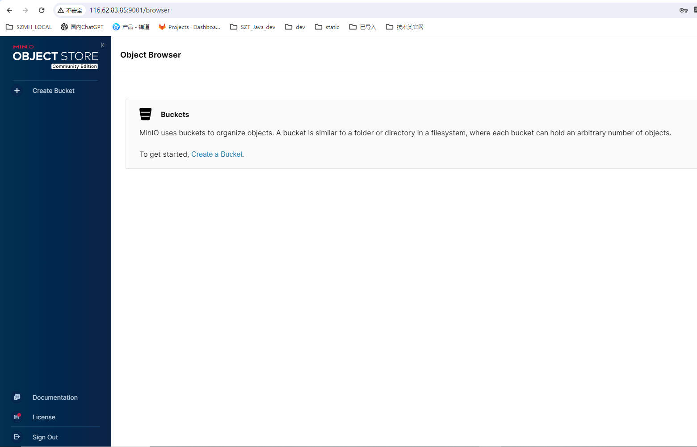

## 🚀 开篇导读：构建企业级高可用对象存储的必备指南

在分布式系统日益普及的今天，如何搭建一套高性能、高可用且云原生友好的对象存储系统，成为许多企业和技术团队面临的重要课题。**MinIO 的多节点多磁盘部署模式（MNMD：Multi-Node Multi-Drive）**，正是为此而生。

本教程手把手教你如何在多台服务器上构建 MinIO 分布式集群，从底层磁盘挂载、系统服务配置，到最终集群测试验证，每一步都覆盖详尽，实战性强。

你将掌握以下关键能力：

* ✅ 部署一套具备纠删码冗余保护的 MinIO 集群，**可容忍半数节点或磁盘宕机仍能读数据**
* ✅ 快速上手磁盘自动挂载脚本，提升系统自动化与可靠性
* ✅ 配置 MinIO 为系统服务并实现开机启动，**贴合生产环境需求**
* ✅ 使用 MinIO 客户端 `mc` 进行对象存储管理与集群验证
* ✅ 了解 MinIO **适用与非适用场景**，避免踩坑

但这只是开始——深入生产落地，你还可以继续探索：

* 🔐 安全加固：启用 HTTPS、IAM 权限管理、桶级访问策略
* 🌐 多地容灾：配置 Site Replication 实现跨站点对象同步与灾备
* 📊 监控与报警：集成 Prometheus + Grafana 构建可视化运维平台
* ☸️ Kubernetes 部署：使用 MinIO Operator 无缝接入容器编排平台
* ♻️ 对象治理：生命周期策略、版本控制、对象加密……全面提升数据治理能力

如果你是一名后端工程师、运维专家、数据平台构建者或 DevOps 从业者，这将是你迈向企业级对象存储架构的重要一课。

---

将这段内容放在教程前，可以让读者快速把握教程的重点与深度，同时也为后续扩展埋下伏笔，引导读者持续关注和学习。

如需我帮你把整篇文章整体结构化整理（如：添加目录、章节导航、Markdown 样式优化等），也可以继续告诉我。

官网地址：https://min.io/docs/minio/linux/operations/install-deploy-manage/deploy-minio-multi-node-multi-drive.html


---

## 一、MinIO 多节点多磁盘安装步骤

### 1. 环境准备

* 操作系统：建议使用 Linux Ubuntu 24.04

* 硬件：  4C  8G  40G*4   4台

* 说明：这里只是演示如何搭建，如果生成环境使用务必保持每个节点内存不低于32GB,  CPU建议12核以上，磁盘使用SSD。

  | ip            | hostname           |
| ------------- | ------------------ |
  | 172.17.73.143 | minio.example1.com |
  | 172.17.73.144 | minio.example2.com |
  | 172.17.73.145 | minio.example3.com |
  | 172.17.73.146 | minio.example4.com |
  
  
  
  ### 1.1 磁盘格式化及挂载
  
  format_and_mount.sh
  
  ```
  #!/bin/bash
  
  set -e
  
  # 检查参数
  if [ $# -ne 2 ]; then
    echo "用法: $0 <磁盘设备名> <挂载点目录>"
    echo "示例: $0 /dev/vdb /mnt/data1"
    exit 1
  fi
  
  DISK_DEVICE="/dev/$1"
  MOUNT_POINT=$2
  
  # 检查磁盘是否存在
  if [ ! -b "$DISK_DEVICE" ]; then
    echo "错误：设备 $DISK_DEVICE 不存在。"
    exit 2
  fi
  
  # 创建挂载目录
  echo "创建挂载目录 $MOUNT_POINT..."
  mkdir -p "$MOUNT_POINT"
  
  # 格式化磁盘为XFS
  echo "格式化 $DISK_DEVICE 为 XFS 文件系统..."
  mkfs.xfs -f "$DISK_DEVICE"
  
  # 获取UUID
  UUID=$(blkid -s UUID -o value "$DISK_DEVICE")
  if [ -z "$UUID" ]; then
    echo "获取 UUID 失败，退出。"
    exit 3
  fi
  
  # 挂载磁盘
  echo "挂载 $DISK_DEVICE 到 $MOUNT_POINT..."
  mount "$DISK_DEVICE" "$MOUNT_POINT"
  
  # 备份 fstab 并写入自动挂载配置
  echo "备份 /etc/fstab 为 /etc/fstab.bak..."
  cp /etc/fstab /etc/fstab.bak
  
  echo "写入开机自动挂载配置..."
  grep -q "$UUID" /etc/fstab || echo "UUID=$UUID $MOUNT_POINT xfs defaults 0 0" >> /etc/fstab
  
  echo "挂载完成，验证挂载信息："
  df -h | grep "$MOUNT_POINT"
  
  echo "✅ 操作完成。"
  ```
  
  使用lsblk来获取没有挂载的磁盘
  
  ```sh
  root@iZbp19o3mb8aenc710gma6Z:~# lsblk
  NAME   MAJ:MIN RM  SIZE RO TYPE MOUNTPOINTS
  vda    253:0    0   40G  0 disk
  ├─vda1 253:1    0    1M  0 part
  ├─vda2 253:2    0  200M  0 part /boot/efi
  └─vda3 253:3    0 39.8G  0 part /
  vdb    253:16   0   40G  0 disk
  vdc    253:32   0   40G  0 disk
  vdd    253:48   0   40G  0 disk
  vde    253:64   0   40G  0 disk
  
  ```
  
  从上面的输出我们可以看出，vdb、vdc、vbd、vbe尚未存在挂载点,执行上面脚本，进行磁盘挂载
  
  ```sh
  root@iZbp19o3mb8aenc710gma6Z:~# bash format_and_mount.sh vdb  /mnt/disk1/minio
  创建挂载目录 /mnt/disk1/minio...
  格式化 /dev/vdb 为 XFS 文件系统...
  meta-data=/dev/vdb               isize=512    agcount=4, agsize=2621440 blks
           =                       sectsz=512   attr=2, projid32bit=1
           =                       crc=1        finobt=1, sparse=1, rmapbt=1
           =                       reflink=1    bigtime=1 inobtcount=1 nrext64=0
  data     =                       bsize=4096   blocks=10485760, imaxpct=25
           =                       sunit=0      swidth=0 blks
  naming   =version 2              bsize=4096   ascii-ci=0, ftype=1
  log      =internal log           bsize=4096   blocks=16384, version=2
           =                       sectsz=512   sunit=0 blks, lazy-count=1
  realtime =none                   extsz=4096   blocks=0, rtextents=0
  挂载 /dev/vdb 到 /mnt/disk1/minio...
  备份 /etc/fstab 为 /etc/fstab.bak...
  root@iZbp19o3mb8aenc710gma6Z:~# bash format_and_mount.sh vdc  /mnt/disk2/minio
  创建挂载目录 /mnt/disk2/minio...
  格式化 /dev/vdc 为 XFS 文件系统...
  meta-data=/dev/vdc               isize=512    agcount=4, agsize=2621440 blks
           =                       sectsz=512   attr=2, projid32bit=1
           =                       crc=1        finobt=1, sparse=1, rmapbt=1
           =                       reflink=1    bigtime=1 inobtcount=1 nrext64=0
  data     =                       bsize=4096   blocks=10485760, imaxpct=25
           =                       sunit=0      swidth=0 blks
  naming   =version 2              bsize=4096   ascii-ci=0, ftype=1
  log      =internal log           bsize=4096   blocks=16384, version=2
           =                       sectsz=512   sunit=0 blks, lazy-count=1
  realtime =none                   extsz=4096   blocks=0, rtextents=0
  挂载 /dev/vdc 到 /mnt/disk2/minio...
  备份 /etc/fstab 为 /etc/fstab.bak...
  root@iZbp19o3mb8aenc710gma6Z:~# bash format_and_mount.sh vdd  /mnt/disk3/minio
  创建挂载目录 /mnt/disk3/minio...
  格式化 /dev/vdd 为 XFS 文件系统...
  meta-data=/dev/vdd               isize=512    agcount=4, agsize=2621440 blks
           =                       sectsz=512   attr=2, projid32bit=1
           =                       crc=1        finobt=1, sparse=1, rmapbt=1
           =                       reflink=1    bigtime=1 inobtcount=1 nrext64=0
  data     =                       bsize=4096   blocks=10485760, imaxpct=25
           =                       sunit=0      swidth=0 blks
  naming   =version 2              bsize=4096   ascii-ci=0, ftype=1
  log      =internal log           bsize=4096   blocks=16384, version=2
           =                       sectsz=512   sunit=0 blks, lazy-count=1
  realtime =none                   extsz=4096   blocks=0, rtextents=0
  挂载 /dev/vdd 到 /mnt/disk3/minio...
  备份 /etc/fstab 为 /etc/fstab.bak...
  root@iZbp19o3mb8aenc710gma6Z:~# bash format_and_mount.sh vde  /mnt/disk4/minio
  创建挂载目录 /mnt/disk4/minio...
  格式化 /dev/vde 为 XFS 文件系统...
  meta-data=/dev/vde               isize=512    agcount=4, agsize=2621440 blks
           =                       sectsz=512   attr=2, projid32bit=1
           =                       crc=1        finobt=1, sparse=1, rmapbt=1
           =                       reflink=1    bigtime=1 inobtcount=1 nrext64=0
  data     =                       bsize=4096   blocks=10485760, imaxpct=25
           =                       sunit=0      swidth=0 blks
  naming   =version 2              bsize=4096   ascii-ci=0, ftype=1
  log      =internal log           bsize=4096   blocks=16384, version=2
           =                       sectsz=512   sunit=0 blks, lazy-count=1
  realtime =none                   extsz=4096   blocks=0, rtextents=0
  挂载 /dev/vde 到 /mnt/disk4/minio...
  备份 /etc/fstab 为 /etc/fstab.bak...
  
  ```
  

### 1.2、域名解析

```

```

上面的1.1,1.2两个步骤4台机器都需要做。

---

### 2. 下载并安装minio

* 安装包方式安装

```bash
wget https://dl.min.io/server/minio/release/linux-amd64/archive/minio_20250613113347.0.0_amd64.deb -O minio.deb
sudo dpkg -i minio.deb
```

使用上面的步骤安装的minio不需要单独在编写Systemd启动服务文件，如果通过二进制方式需要按照第5步所述操作执行。

二进制方式安装

```
wget https://dl.min.io/server/minio/release/linux-arm64/minio
chmod +x minio
mv minio /usr/local/bin/
```

### 3. MinIO 数据目录

每个节点上的/mnt/disk1/minio、/mnt/disk2/minio、/mnt/disk3/minio、/mnt/disk4/minio就是我们存储minio的数据目录

---

### 4. 创建 MinIO 运行用户

```bash
groupadd -r minio-user
useradd -M -r -g minio-user minio-user
chown minio-user:minio-user /mnt/disk{1..4}/minio
```

---

### 5. 编写 Systemd 启动服务文件

```bash
sudo nano /etc/systemd/system/minio.service
```

内容如下：

```ini
[Unit]
Description=MinIO
Documentation=https://docs.min.io
Wants=network-online.target
After=network-online.target
AssertFileIsExecutable=/usr/local/bin/minio

[Service]
Type=notify

WorkingDirectory=/usr/local

User=minio-user
Group=minio-user
ProtectProc=invisible

EnvironmentFile=-/etc/default/minio
ExecStart=/usr/local/bin/minio server $MINIO_OPTS $MINIO_VOLUMES

# Let systemd restart this service always
Restart=always

# Specifies the maximum file descriptor number that can be opened by this process
LimitNOFILE=1048576

# Turn-off memory accounting by systemd, which is buggy.
MemoryAccounting=no

# Specifies the maximum number of threads this process can create
TasksMax=infinity

# Disable timeout logic and wait until process is stopped
TimeoutSec=infinity

# Disable killing of MinIO by the kernel's OOM killer
OOMScoreAdjust=-1000

SendSIGKILL=no

[Install]
WantedBy=multi-user.target

# Built for ${project.name}-${project.version} (${project.name})
```

---

### 6. 编写 环境变量文件

**/etc/default/minio**

```properties
# MINIO_ROOT_USER and MINIO_ROOT_PASSWORD sets the root account for the MinIO server.
# This user has unrestricted permissions to perform S3 and administrative API operations on any resource in the deployment.
# Omit to use the default values 'minioadmin:minioadmin'.
# MinIO recommends setting non-default values as a best practice, regardless of environment
MINIO_ROOT_USER=myminioadmin
MINIO_ROOT_PASSWORD=minio-secret-key-change-me

# MINIO_VOLUMES sets the storage volume or path to use for the MinIO server.

MINIO_VOLUMES="http://minio.example{1...4}.com:9000/mnt/disk{1...4}/minio"

# MINIO_OPTS sets any additional commandline options to pass to the MinIO server.
# For example, `--console-address :9001` sets the MinIO Console listen port
MINIO_OPTS="--console-address :9001"
```


### 7. 启动并启用 MinIO 服务

```bash
sudo systemctl daemon-reload
# 设置开机自启动
sudo systemctl enable minio
# 启动minio
sudo systemctl start minio
# 查看minio启动状态
sudo systemctl status minio
```

---

### 8. 访问 MinIO

* 控制台地址（Web UI）：`http://<your-ip>:9001`
* API 端点：`http://<your-ip>:9000`

使用上述配置的 myminioadmin/minio-secret-key-change-me登录即可

如：http://116.62.83.85:9001/login




---

##  二、MinIO 集群测试（一台机器上操作即可）

```bash
wget https://dl.min.io/client/mc/release/linux-amd64/mc
chmod +x mc
sudo mv mc /usr/local/bin/
```

添加 MinIO 实例：

```bash
mc alias set local http://localhost:9000 myminioadmin minio-secret-key-change-me
```

测试操作：

```bash
# 创建桶
root@iZbp1bnsdgk7l6gjkh64wzZ:~# mc mb local/mytestbucket
Bucket created successfully `local/mytestbucket`.   
#上传文件
root@iZbp1bnsdgk7l6gjkh64wzZ:~# mc cp ./README.md local/mytestbucket
/root/README.md:                    43.86 KiB / 43.86 KiB  1.25 MiB/s 0s

# 查看文件
root@iZbp1bnsdgk7l6gjkh64wzZ:~# mc ls local/mytestbucket
[2025-07-08 11:27:24 CST]  44KiB STANDARD README.md
```

注意上面的local要跟之前的mc alias set local保持一致


查看文件在物理机器上存储情况：

```
root@iZbp189qagfj8rlylk0he3Z:~# ls -lh /mnt/disk{1..4}/minio/mytestbucket/mc/de17ac6e-afcc-4e37-a124-f63d2ac05d17
/mnt/disk1/minio/mytestbucket/mc:
total 4.0K
drwxr-xr-x 2 minio-user minio-user  34 Jul  9 17:53 /de17ac6e-afcc-4e37-a124-f63d2ac05d17
-rw-r--r-- 1 minio-user minio-user 434 Jul  9 17:53 xl.meta

/mnt/disk2/minio/mytestbucket/mc:
total 4.0K
drwxr-xr-x 2 minio-user minio-user  34 Jul  9 17:53 de17ac6e-afcc-4e37-a124-f63d2ac05d17
-rw-r--r-- 1 minio-user minio-user 434 Jul  9 17:53 xl.meta

/mnt/disk3/minio/mytestbucket/mc:
total 4.0K
drwxr-xr-x 2 minio-user minio-user  34 Jul  9 17:53 de17ac6e-afcc-4e37-a124-f63d2ac05d17
-rw-r--r-- 1 minio-user minio-user 434 Jul  9 17:53 xl.meta

/mnt/disk4/minio/mytestbucket/mc:
total 4.0K
drwxr-xr-x 2 minio-user minio-user  34 Jul  9 17:53 de17ac6e-afcc-4e37-a124-f63d2ac05d17
-rw-r--r-- 1 minio-user minio-user 434 Jul  9 17:53 xl.meta

```

每台机器上都有对应的数据，说明文件被分片存储了

##  三、使用场景说明（多节点多磁盘）

###  适用场景：

| 场景                             | 描述                                                         |
| -------------------------------- | ------------------------------------------------------------ |
| **企业级存储系统**               | 适合部署在需要高并发访问和数据持久化保障的场景，如日志归档、视频存储、机器学习训练数据等。 |
| **容器化平台（Kubernetes）**     | 可作为 Ceph 的替代方案，集成简单，支持对象存储接口（S3兼容）。 |
| **数据湖/大数据平台**            | 用于支持 Spark、Hadoop、Presto、Trino 等工具读取数据。       |
| **跨机房部署（可配置站点容灾）** | 结合 Site Replication 实现多地备份与灾难恢复。               |
| **云原生微服务架构**             | 支持多租户访问，适合与 API 网关、认证服务等集成。            |

---

### 🚫 不适用场景：

| 场景                                           | 原因                                                         |
| ---------------------------------------------- | ------------------------------------------------------------ |
| **单机部署或仅需轻量级对象存储的开发测试环境** | MNMD 配置复杂、资源开销大，MinIO 提供了 **单节点单盘模式** 更适合小规模环境。 |
| **高频删除/写入小文件场景**                    | 虽然支持，但纠删码对小文件频繁变更性能不如纯副本机制。       |
| **需要文件系统语义（如 POSIX 的随机写）**      | MinIO 是对象存储，不支持传统文件系统的随机写、文件锁等语义。 |
| **频繁断网的网络不稳定环境**                   | 分布式部署依赖节点间的高速网络通信，网络不稳定可能导致集群频繁故障。 |

---

## 总结

本教程手把手带你完成了 MinIO 分布式存储的搭建与基本验证，是构建企业级对象存储系统的第一步。