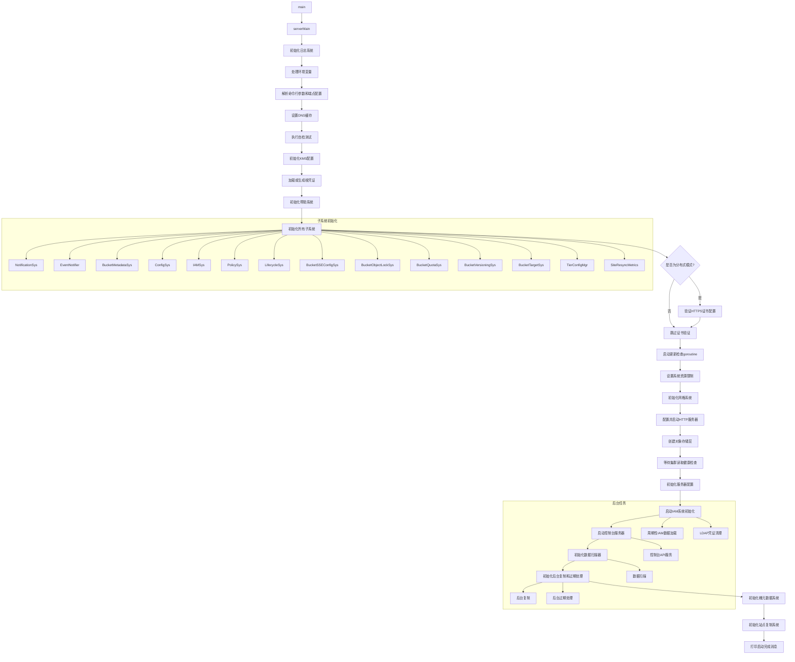

## 二、启动流程
1、启动流程示意图



## 1. 命令行参数和配置处理

- 使用 [ServerFlags](minio\cmd\server-main.go#L61-L196) 定义服务器命令的特定标志
- [serverCmd](minio\cmd\server-main.go#L198-L240) 定义了 `server` 命令的使用方法和帮助模板
- 通过 [serverCmdArgs](minio\cmd\server-main.go#L242-L270) 函数处理命令行参数或环境变量配置

## 2. 服务器上下文构建和参数处理

- [mergeServerCtxtFromConfigFile](minio\cmd\server-main.go#L302-L370) 从配置文件中读取配置信息
- [serverHandleCmdArgs](minio\cmd\server-main.go#L372-L447) 处理通用参数，包括：
    - 验证服务器地址
    - 加载 TLS 证书和 Root CA
    - 创建服务器端点
    - 设置网络接口和 TCP 选项
    - 初始化内部节点传输机制

## 3. 系统初始化阶段

- [initializeLogRotate](minio\cmd\server-main.go#L713-L742) 初始化日志轮转功能
- [handleSignals](minio\cmd\signals.go#L45-L124) 设置信号处理机制
- [loadEnvVarsFromFiles](minio\cmd\common-main.go#L647-L701) 加载环境变量
- [runDNSCache](minio\cmd\common-main.go#L526-L552) 启动 DNS 缓存子系统
- 执行各种自检测试（bitrot、erasure、compress）

## 4. 认证和安全配置

- [handleKMSConfig](minio\cmd\common-main.go#L916-L939) 初始化 KMS 配置
- [loadRootCredentials](minio\cmd\common-main.go#L834-L873) 加载根用户凭证
- 生成节点间认证令牌

## 5. 子系统初始化

- [initAllSubsystems](minio\cmd\server-main.go#L449-L503) 初始化所有核心子系统：
    - 通知系统
    - 桶元数据系统
    - 配置系统
    - IAM 系统
    - 生命周期管理
    - 加密配置
    - 配额管理
    - 版本控制
    - 复制目标系统
    - 分层存储管理

## 6. 网格和锁服务初始化

- [initGlobalGrid](minio\cmd\grid.go#L42-L73) 初始化服务器网格 RPC 服务
- [initGlobalLockGrid](minio\cmd\grid.go#L75-L106) 初始化服务器锁网格 RPC 服务

## 7. HTTP 服务器配置和启动

- [configureServerHandler](minio\cmd\routers.go#L83-L114) 配置服务器处理程序
- 启动 HTTP 服务器监听请求
- 在分布式模式下验证系统配置

## 8. 对象存储层初始化

- [newObjectLayer](minio\cmd\server-main.go#L1198-L1200) 创建对象存储层（使用擦除编码）
- `waitForQuorum` 等待读取多数派确认

## 9. 服务器配置初始化

- [initServerConfig](minio\cmd\server-main.go#L584-L623) 初始化服务器配置
- 启动后台 IAM 系统初始化
- 如果启用浏览器界面，初始化控制台服务器
- 启动 FTP/SFTP 服务器（如果配置了相关参数）

## 10. 后台服务初始化

- 数据扫描器
- 后台复制服务
- 后台过期处理
- 存储类别转换
- 桶通知目标
- 桶元数据系统
- 站点复制
- 批处理作业池

## 11. 启动完成

- [printStartupMessage](minio\cmd\server-startup-msg.go#L38-L70) 打印启动完成信息
- 启动资源指标收集
- 通知 systemd 服务已就绪
- 等待系统信号以优雅关闭

整个启动流程设计为模块化和可追踪的

## 三、日志系统初始化

### 1. 初始化入口
在 [serverMain](file://E:\langchain4go\minio\cmd\server-main.go#L745-L1195) 函数中，通过 [bootstrapTrace](file://E:\langchain4go\minio\cmd\server-main.go#L559-L582) 调用 `newConsoleLogger` 来初始化日志系统：

```go
bootstrapTrace("newConsoleLogger", func() {
    output, err := initializeLogRotate(ctx)
    if err == nil {
        logger.Output = output
        globalConsoleSys = NewConsoleLogger(GlobalContext, output)
        globalLoggerOutput = output
    } else {
        logger.Output = os.Stderr
        globalConsoleSys = NewConsoleLogger(GlobalContext, os.Stderr)
    }
    logger.AddSystemTarget(GlobalContext, globalConsoleSys)

    // Set node name, only set for distributed setup.
    globalConsoleSys.SetNodeName(globalLocalNodeName)
    if err != nil {
        // We can only log here since we need globalConsoleSys initialized
        logger.Fatal(err, "invalid --logrorate-dir option")
    }
})
```


### 2. 日志轮转配置
核心函数是 `initializeLogRotate`，它负责配置日志轮转功能：

#### 参数检查和处理
- 检查是否指定了日志目录 (`log-dir` 参数)
- 如果没有指定日志目录，直接返回标准错误输出 `os.Stderr`
- 获取日志目录的绝对路径

#### 日志文件命名
- 如果设置了日志前缀 (`log-prefix`)，则使用自定义文件名函数
- 文件名格式为: `{prefix}-{timestamp}.log`

#### 日志轮转配置
使用 `logger.NewDir` 创建轮转日志输出器，配置包括：
- 目录路径
- 最大文件大小 (`log-size` 参数，默认10MB)
- 是否压缩 (`log-compress` 参数)
- 文件名函数

#### JSON格式启用
调用 `logger.EnableJSON()` 启用JSON格式日志输出

### 3. 全局日志系统设置
- 将创建的输出器设置为 `logger.Output`
- 创建 `ConsoleLogger` 实例并赋值给 `globalConsoleSys`
- 通过 `logger.AddSystemTarget` 将控制台日志系统添加为目标
- 在分布式设置中设置节点名称

### 4. 错误处理
- 如果日志轮转初始化失败，回退到使用标准错误输出
- 如果初始化失败且日志系统已设置，记录致命错误

### 主要特性

1. **可选的日志目录**：通过 `--log-dir` 参数指定
2. **日志轮转**：基于文件大小的轮转机制
3. **可配置的文件大小**：默认10MB，可通过 `--log-size` 参数调整
4. **压缩支持**：通过 `--log-compress` 参数启用gzip压缩
5. **自定义前缀**：通过 `--log-prefix` 参数自定义日志文件名前缀
6. **JSON格式**：所有日志以JSON格式输出
7. **分布式支持**：在分布式环境中设置节点名称

这个设计使得MinIO可以灵活地处理日志输出，既可以输出到标准错误，也可以输出到指定目录的轮转文件中，满足不同部署环境的需求。


